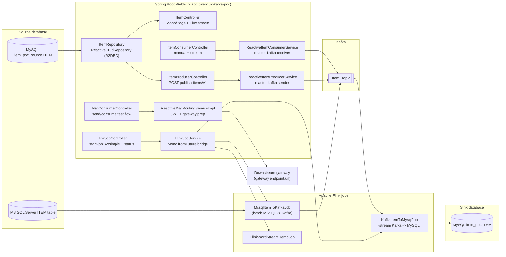

# Architecture - WebFlux Kafka Producer / Consumer / Flink POC

This document describes the **reactive** backend architecture implemented in this repository.

## 1) High-level component diagram

## 2) Reactive request flow

- HTTP requests are served by **WebFlux + Netty**.
- Controllers return `Mono<T>` / `Flux<T>`.
- DB reads use **R2DBC** (`ItemRepository`) and do not block event-loop threads.
- Kafka send/receive uses **reactor-kafka** and is non-blocking.

## 3) Where blocking still exists (and how it is handled)

Some integrations are naturally blocking and are wrapped safely:

1. Manual Kafka polling (`KafkaConsumer.poll`) is wrapped with `Mono.fromCallable(...).subscribeOn(Schedulers.boundedElastic())`.
2. Flink jobs run outside Reactor and are started via `CompletableFuture.runAsync(...)`, then bridged to WebFlux responses with `Mono.fromFuture(...)`.

This keeps the HTTP layer reactive even when using blocking libraries.

## 4) Endpoint behavior (sync vs async)

| Endpoint | Behavior |
|---|---|
| `GET /item-kafka/app/items/v1` | Reactive DB query (`Mono<PageResult<Item>>`) |
| `GET /item-kafka/app/items/stream/v1` | Reactive item stream (`Flux<Item>`) |
| `POST /item-kafka/app/publish-items/v1` | Reactive Kafka publish chain |
| `POST /item-kafka/consumer/manual-consume/v1` | Blocking poll wrapped in bounded-elastic scheduler |
| `GET /item-kafka/consumer/consume-stream/v1` | Live Kafka stream (`Flux<Item>`) |
| `POST /flink/start-job1` / `start-job2` | Async background execution; HTTP returns after submit |
| `POST /flink/start-simple-job` | Short job wrapped in `Mono` |
| `GET /flink/job-status` | In-memory status lookup |

## 5) Frontend integration notes

- Default backend URL: `http://localhost:8082`
- CORS is configured in `src/main/java/com/antontech/webflux_kafka/configuration/CorsConfig.java`
- Allowed origins are controlled by `ITEM_CORS_ALLOWED_ORIGINS`

## 6) Why this architecture

- Keep original Kafka/Flink business flow intact.
- Move web + DB layers to reactive primitives for better concurrency under I/O-heavy workloads.
- Demonstrate practical migration strategy: reactive where it fits, bridge wrappers where full reactive conversion is not realistic (Flink/manual poll).
