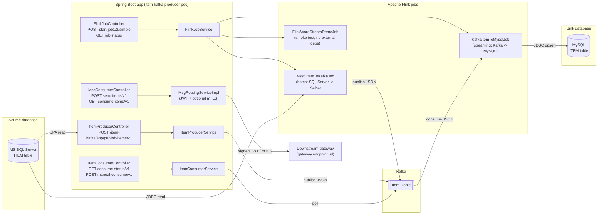
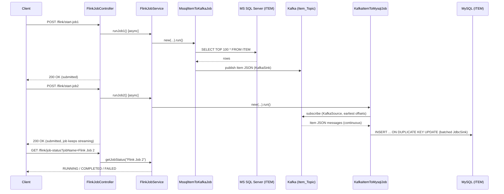
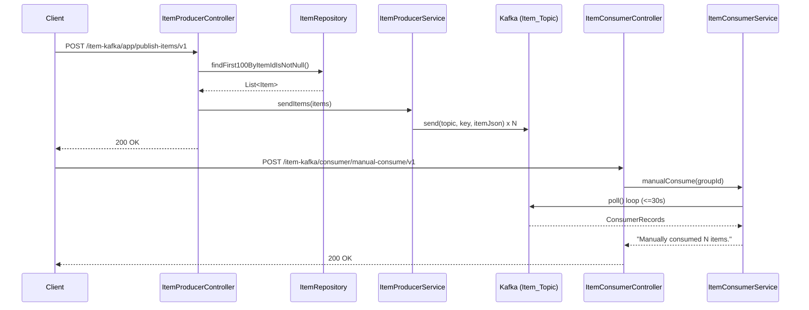
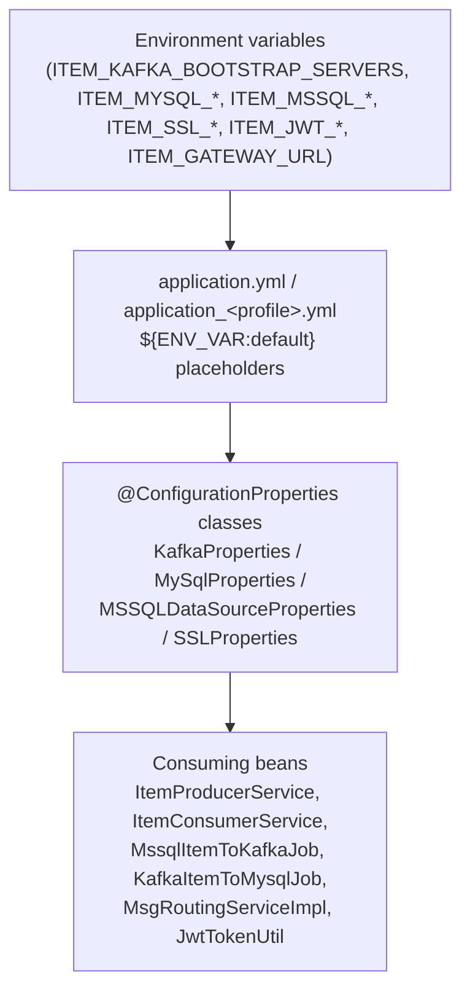
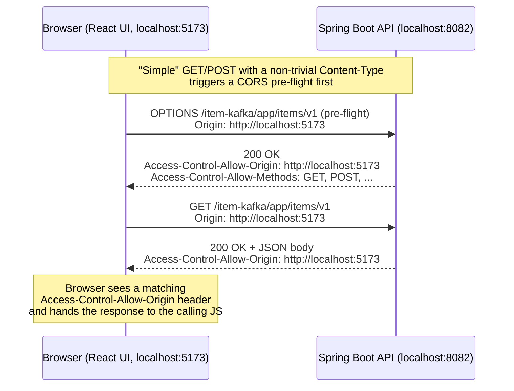

# Architecture

End-to-end view of how data moves through this POC, from the source `Item`
table through Kafka and Apache Flink to the MySQL sink table, plus how the
REST layer ties it all together.

## 1. High-level component diagram



## 2. End-to-end sequence: Flink pipeline (the "real" replication path)



## 3. End-to-end sequence: Spring Kafka producer/consumer path (lighter demo)



## 4. Component responsibilities

| Layer | Class(es) | Responsibility |
|---|---|---|
| REST - producer | `ItemProducerController`, `ItemProducerService` | Read `Item` rows via JPA, publish to Kafka |
| REST - items grid | `ItemController` | Paginated `GET items/v1` (and `GET items/count/v1`) used by the React front end's Item grid/pager |
| REST - consumer | `ItemConsumerController`, `ItemConsumerService` | On-demand poll of the shared Kafka topic |
| REST - gateway test | `MsgConsumerController`, `MsgRoutingServiceImpl`, `JwtTokenUtil` | Demonstrates JWT-signed / optionally mTLS-secured calls to an external gateway |
| REST - Flink control plane | `FlinkJobController`, `FlinkJobService`, `JobStatus` | Starts/tracks the Flink jobs on demand instead of requiring a separate cluster submission |
| Flink - batch source | `MssqlItemToKafkaJob` | One-shot read of up to 100 rows from SQL Server, publish as JSON to Kafka |
| Flink - streaming sink | `KafkaItemToMysqlJob` | Unbounded consumption from Kafka, batched upsert into MySQL |
| Flink - smoke test | `FlinkWordStreamDemoJob` | Dependency-free job to validate the Flink runtime independent of Kafka/JDBC |
| Config | `KafkaProperties`, `MySqlProperties`, `MSSQLDataSourceProperties`, `SSLProperties` | Type-safe, environment-variable-driven configuration - no hardcoded secrets or connection strings |
| Domain model | `Item`, `ManualConsumeRequest`, `ServiceRequest`, `JwtResponse` | JPA entity + REST request/response DTOs |

## 5. Data model

`Item` (`src/main/java/com/antontech/itemkafka_poc/model/Item.java`) is a JPA
entity mapped to the `ITEM` table on both sides of the pipeline (SQL Server
source, MySQL sink) and is also the JSON payload shape published to/consumed
from Kafka (serialized with Gson using a custom `LocalDateTimeAdapter` for
`LocalDateTime` fields). See `DATABASE_SETUP.md` for the full column list and
both the SQL Server and MySQL DDL scripts.

## 6. Why Apache Flink is used here (and what it buys you over the plain Spring Kafka consumer)

The Spring Kafka path (`ItemConsumerService`) is intentionally simple: it
opens a short-lived `KafkaConsumer`, polls for up to ~30 seconds and stops.
That's fine for a demo/manual-trigger scenario, but it does not scale and has
no fault tolerance built in. Apache Flink is used for the "real" replication
path (`KafkaItemToMysqlJob`) because it provides, largely for free:

- **True unbounded streaming, not polling.** Flink's `KafkaSource` maintains a
  long-lived, continuously-running dataflow that reacts to new Kafka records
  as they arrive, instead of a client repeatedly opening/closing connections
  and possibly missing records between polls.
- **Backpressure handling.** If MySQL momentarily can't keep up with the
  batch upsert rate, Flink automatically slows down how fast it reads from
  Kafka rather than buffering unboundedly in memory or dropping records.
- **Built-in batching and retries at the sink.** `JdbcSink` here is
  configured with `withBatchSize(1000)` / `withBatchIntervalMs(200)` /
  `withMaxRetries(3)` - Flink batches many small upserts into fewer, larger
  round trips to MySQL, which is dramatically faster than one `INSERT` per
  Kafka record, and automatically retries a failed batch instead of losing it.
- **Horizontal scalability.** The same job definition can be resubmitted to a
  real Flink cluster with a higher parallelism (`flink.parallelism.default`
  in `application.yml`) to consume multiple Kafka partitions in parallel with
  no code changes - the embedded `StreamExecutionEnvironment` used here for
  the demo is a drop-in stand-in for a full cluster deployment.
- **Exactly-once/at-least-once semantics options.** Flink's checkpointing
  model (not fully wired up in this POC, but available) is what lets
  production deployments guarantee no data is lost or duplicated across
  restarts - something a hand-rolled polling consumer would have to
  reimplement from scratch (manual offset tracking, idempotency, etc.).
- **Decoupling of runtime lifecycle from the calling HTTP request.** Because
  `KafkaItemToMysqlJob` is an unbounded stream, it is deliberately triggered
  **asynchronously** (see section 7) so the triggering REST call can return
  immediately while replication keeps running in the background - exactly the
  kind of long-running workload Flink is designed for and a plain
  request/response controller method is not.

In short: the Spring consumer path exists to demonstrate the "manual poll"
mental model simply; the Flink path exists to demonstrate how you'd actually
build a resilient, scalable, continuously-running Kafka-to-database
replication pipeline in production.

## 7. Synchronous vs. asynchronous endpoints

This matters a lot for a future front-end: some endpoints return only once
all work is done (safe to await directly and update the UI from the
response), while others return immediately and the real work continues in
the background (the UI must poll or otherwise check back later).

| Endpoint | Controller method | Sync or Async? | Why |
|---|---|---|---|
| `POST /item-kafka/app/publish-items/v1` | `ItemProducerController.createItemKafkaTopic()` | **Synchronous** | Reads up to 100 rows and calls `kafkaTemplate.send(...).get()` (blocking) for each one before returning |
| `GET /item-kafka/app/items/v1` | `ItemController.listItems()` | **Synchronous** | Simple paginated JPA `findAll(Pageable)` query, no external I/O |
| `GET /item-kafka/app/items/count/v1` | `ItemController.countItems()` | **Synchronous** | Simple JPA `count()` query |
| `GET /item-kafka/consumer/consume-status/v1` | `ItemConsumerController.checkConsumerStatus()` | **Synchronous** | In-memory boolean check, no I/O |
| `POST /item-kafka/consumer/manual-consume/v1` | `ItemConsumerController.manualConsumeItem()` | **Synchronous (but slow - up to ~30s)** | Blocks the HTTP request thread for the whole poll loop before responding; a front end should show a spinner/loading state for the full duration |
| `POST /item-kafka/app/send-items/v1` | `MsgConsumerController.sendItemsToKafka()` | **Synchronous** | Builds the JWT and prepares the request inline; no background thread involved |
| `GET /item-kafka/app/consume-items/v1` | `MsgConsumerController.consumeItemsFromKafka()` | **Synchronous** | Just logs and returns |
| `POST /flink/start-job1` | `FlinkJobController.triggerFlinkJob1()` | **Asynchronous** | Wrapped in `CompletableFuture.runAsync(...)`; returns `200 OK` immediately while `MssqlItemToKafkaJob` runs on a background thread |
| `POST /flink/start-job2` | `FlinkJobController.triggerFlinkJob2()` | **Asynchronous, and the job itself never "finishes" on its own** | Also wrapped in `CompletableFuture.runAsync(...)`; `KafkaItemToMysqlJob` is an unbounded stream that keeps consuming until the process stops or the job is cancelled - the HTTP call only confirms it was *submitted*, not completed |
| `POST /flink/start-simple-job` | `FlinkJobController.triggerFlinkSimpleJob()` | **Synchronous** | Deliberately *not* wrapped in `CompletableFuture` - the demo job is short and the controller waits for it so you get an immediate pass/fail result |
| `GET /flink/job-status?jobName=` | `FlinkJobController.getJobStatus()` | **Synchronous** | Simple in-memory map lookup (`FlinkJobService.jobStatuses`) - this is the endpoint a front end polls to find out when an async job has finished |

### 7.1 How a front end should trigger and observe the async jobs

Since `/flink/start-job1` and `/flink/start-job2` return before the work is
done, there is no webhook/callback/WebSocket built into this POC to push
completion events to a client. The supported pattern is **client-side
polling** of `/flink/job-status`:

```mermaid
sequenceDiagram
    participant UI as React UI
    participant API as FlinkJobController
    participant Svc as FlinkJobService
    participant Job as MssqlItemToKafkaJob / KafkaItemToMysqlJob

    UI->>API: POST /flink/start-job1
    API->>Svc: runJob1() [CompletableFuture.runAsync]
    API-->>UI: 200 OK "Flink Job 1 started successfully." (immediate)
    Note over Svc,Job: Job runs in a background thread;<br/>status flips RUNNING -> COMPLETED/FAILED

    loop Poll every 2-3 seconds until COMPLETED/FAILED
        UI->>API: GET /flink/job-status?jobName=Flink Job 1
        API->>Svc: getJobStatus("Flink Job 1")
        Svc-->>API: PENDING | RUNNING | COMPLETED | FAILED
        API-->>UI: current status
    end

    UI->>UI: Update job card / progress indicator once status is COMPLETED or FAILED
```

Practical guidance for the upcoming React client:
- Treat `start-job1`/`start-job2` calls like "fire, then poll" - disable the
  trigger button and show a spinner/"Running..." badge immediately on submit,
  independent of the (fast) HTTP response.
- Poll `GET /flink/job-status?jobName=Flink Job 1` (or `Flink Job 2` /
  `Flink Simple Job`) on an interval (e.g. every 2-3 seconds with
  `setInterval`/a small polling hook) and stop polling once the status is
  `COMPLETED` or `FAILED`.
- Remember `Flink Job 2` is an unbounded stream - once `RUNNING`, it is
  expected to **stay** `RUNNING` indefinitely (there's no automatic
  `COMPLETED` state for it in this POC unless it errors out). Message this
  clearly in the UI, e.g. "Streaming replication is active" rather than a
  progress bar that implies an end state.
- `start-simple-job` and every non-Flink endpoint can simply be awaited
  directly (standard `fetch`/`axios` request/response), no polling needed.

## 8. Configuration and secrets flow



No credential, connection string, keystore password or private key is ever
committed to source control - see `SETUP_GUIDE.md` for how to supply your own
values for a local demo.

## 9. CORS: how the React front end is allowed to call this API

The companion React UI (`ReactJS-UI-For-Item-Kafka-Producer-POC`, typically
served by Vite on `http://localhost:5173`) runs on a **different origin**
(different scheme+host+port combination) than this API
(`http://localhost:8082`). Browsers enforce the **Same-Origin Policy**: by
default, JavaScript running on one origin is not allowed to read the response
of an HTTP request made to a different origin, even if the server processed
the request successfully. **CORS (Cross-Origin Resource Sharing)** is the
mechanism browsers use to relax that restriction, driven entirely by response
headers the *server* sends back.



How it is wired up in this repository:

- `CorsConfig` (`src/main/java/com/antontech/itemkafka_poc/configuration/CorsConfig.java`)
  registers a `WebMvcConfigurer.addCorsMappings(...)` rule (plus a
  `CorsConfigurationSource` bean for defence-in-depth if a security filter
  chain is ever added) that allows `GET/POST/PUT/DELETE/PATCH/OPTIONS`, any
  request header, and exposes the `Authorization` header, for the configured
  list of origins.
- Allowed origins are **externalised**, not hardcoded: `cors.allowed-origins`
  in `application.yml` (env var `ITEM_CORS_ALLOWED_ORIGINS`, comma-separated),
  defaulting to `http://localhost:5173,http://localhost:3000` to cover both
  Vite's and Create-React-App-style dev servers out of the box.
- No cookies/HTTP-session credentials are used by this API (it is stateless,
  JWT-signed where auth is relevant), so `allowCredentials` is left `false`
  and the wildcard-style broad `allowedHeaders("*")` is safe here - if this
  were extended to use cookie-based sessions, `allowCredentials(true)` would
  require an **explicit** origin list instead of a wildcard.
- For a production deployment, set `ITEM_CORS_ALLOWED_ORIGINS` to the real
  front-end domain(s) only (e.g. `https://items.antontech.co.za`) to avoid
  leaving local dev ports open on the public API.

